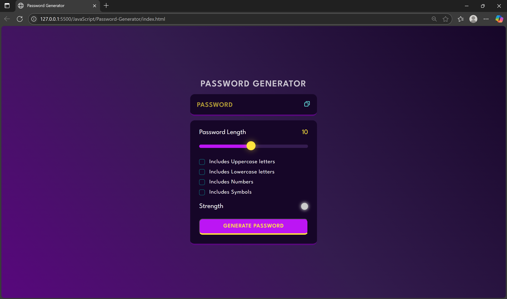
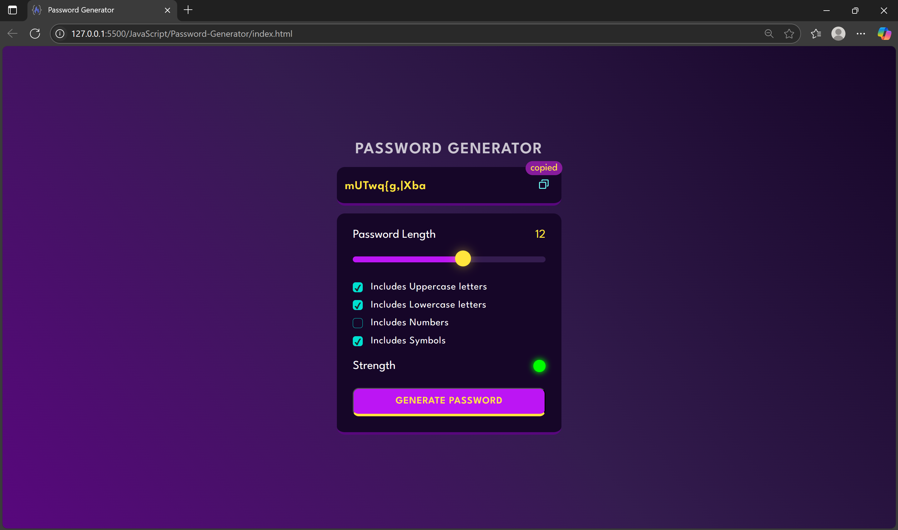

# Password-Generator

A professional, responsive web-based password generator that allows users to generate strong passwords with customizable criteria. The project includes real-time password strength feedback and clipboard support.

## Features

- Generate random passwords of customizable length
- Choose character types: 
  - Uppercase letters
  - Lowercase letters
  - Numbers
  - Symbols
- Visual strength indicator
- Copy password to clipboard with one click
- Responsive and modern UI

## Technologies Used

- HTML5
- CSS3 (with custom properties and responsive design)
- JavaScript (ES6+)
- Google Fonts (League Spartan)

## Folder Structure

```
Password-Generator/
├── assets/
│   ├── copy.svg
│   └── favicon.ico
├── .gitattributes
├── index.html
├── script.js
├── styles.css
└── README.md
```

## Screenshots

### Password Generator Interface


### Clipboard Copy Function



## How to Run

1. Clone or download this repository.
2. Open `index.html` in your browser.
3. Use the available options to generate and copy a secure password.

## License

This project is free to use for personal and educational purposes.


## Author

Arshnoor Singh